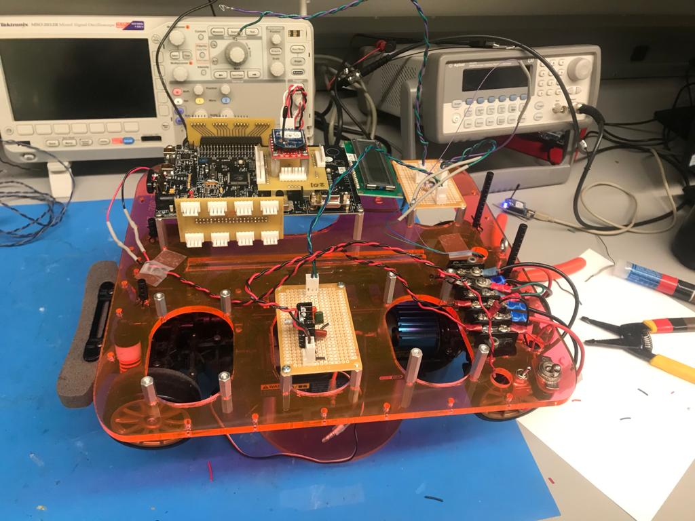

# car speed control
<b>Code:</b> car-speed-control.py  
<b>Report:</b> [car-speed-control-report.pdf](./speed-control/car-speed-control-report.pdf)  

# romi-agri-robot
## Dependencies:
1. Flask: https://pypi.org/project/Flask/
2. Pololu A-Star 32U4 Arduino Library: https://www.pololu.com/docs/0J66/5
3. Libpixyusb2 Library: https://github.com/charmedlabs/pixy2

## To Run:
`python main.py --config_file romi_config.json`

## Report:
[agromi-report.pdf](./agromi-report.pdf)  

## Demo:
<b>Robot Routine:</b> https://youtu.be/xkgxyM7SDjU  
<b>User Interface:</b> https://youtu.be/dYJ0u37XE_E

