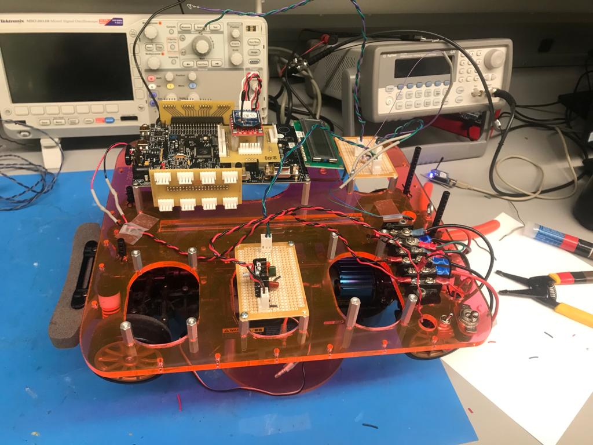

# car speed control
<b>Code:</b> car-speed-control.py  
<b>Report:</b> [car-speed-control-report.pdf](./car-speed-control-report.pdf)  
<b>Car:</b>

# romi-agri-robot
## Dependencies:
1. Flask: https://pypi.org/project/Flask/
2. Pololu A-Star 32U4 Arduino Library: https://www.pololu.com/docs/0J66/5
3. Libpixyusb2 Library: https://github.com/charmedlabs/pixy2

## To Run:
`python serverencode2.py --config_file romi_config.json`
